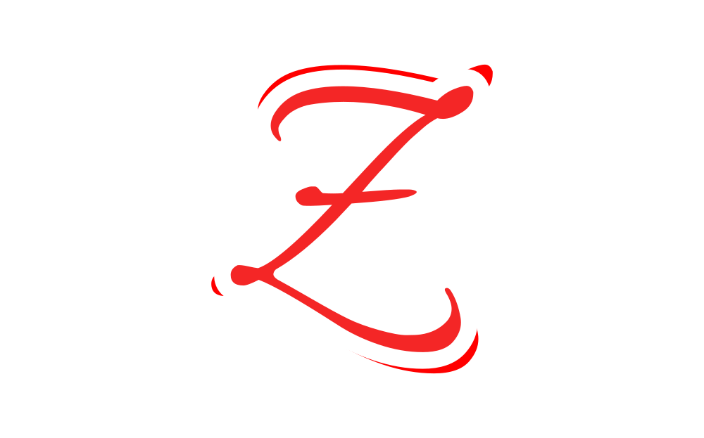
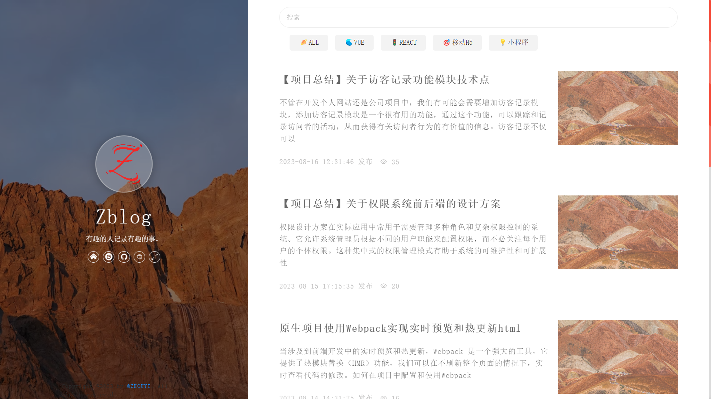
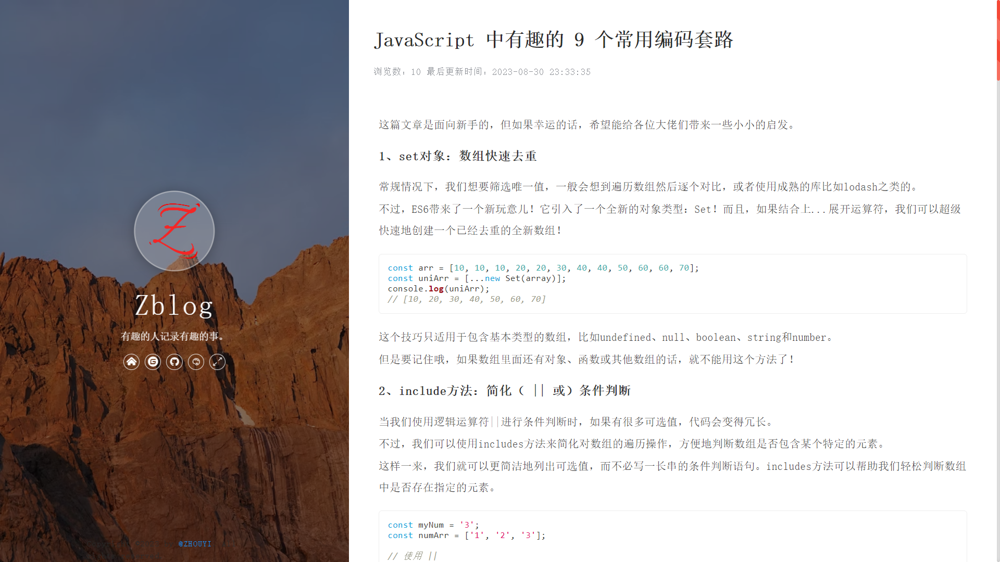

# 简约博客前端模板

<h3 align="center">" 🔥 Zblog "</h3>
  

    基于React实现好看清新简约的博客模板，可以用来做个人博客，个人主页、工作室官网、自媒体官网、产品展示等网站。
     
    <a href="https://github.com/ZHYI-source/ZHOUYI-Homepage.git" target="_blank"><strong>探索本项目的源码 »</strong></a>
     
    <a href="http://www.zhouyi.run/" target="_blank"><strong>在线示例点这里 »</strong></a>
     
    

 ## 截图
 
 
 
